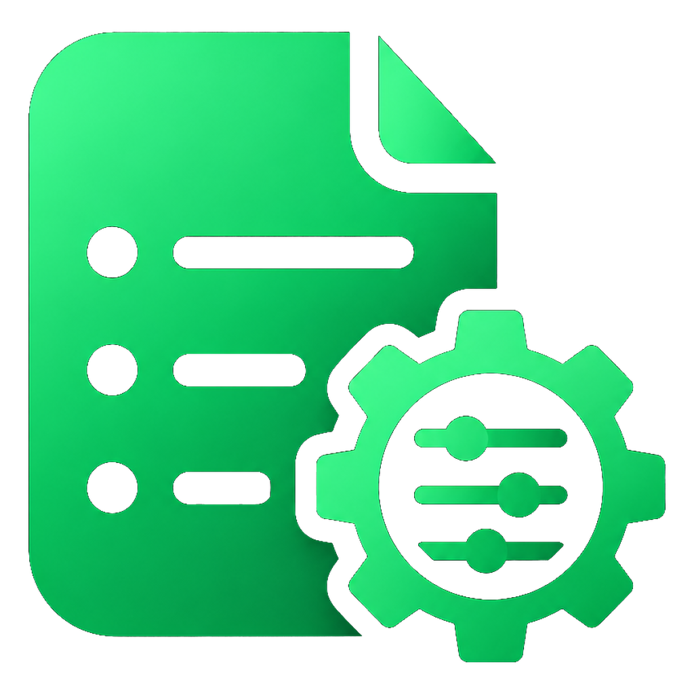
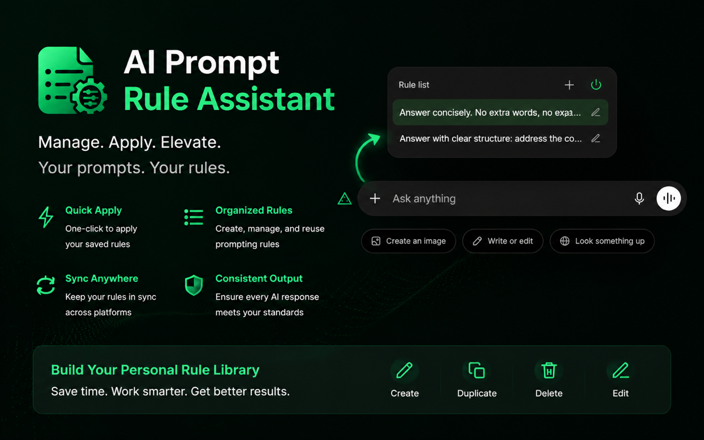

<p align="center">
  
</p>

# AI Prompt Rule Assistant

Stop pasting the same AI instructions again and again.

AI Prompt Rule Assistant is a browser extension for saving reusable prompt rules and appending the selected rule before sending messages on supported AI chat platforms.



## Why Use It

- Save common instructions once and reuse them anywhere you chat with AI.
- Keep AI answers consistent across conversations.
- Apply different rules for different platforms and workflows.
- Turn prompt-rule injection on or off directly beside the chat input.
- Avoid duplicate `<RULES>` blocks when a rule has already been appended.

## Supported Platforms

- DeepSeek: `*://chat.deepseek.com/*`
- ChatGPT: `*://chatgpt.com/*`
- Kimi: `*://www.kimi.com/*`

Claude is not enabled in the current content-script preset or host permissions.

## Features

### Rule Management

- Create, edit, preview, copy, enable, disable, and delete prompt rules.
- Assign rules to one or more platforms.
- Set a default rule for each platform.
- Store rules and settings locally.

### In-Page Trigger

- Shows a compact trigger near the chat input.
- Opens a rule panel without leaving the chat page.
- Lets you select, add, edit, enable, or disable rules in context.
- Auto-enables injection for new conversations and disables it after injection or once a conversation starts.

### Platform Settings

Each platform can be configured with:

- match URL
- input selector
- submit button selector
- conversation container selector
- conversation item selector
- trigger X/Y offset

## Injection Format

When enabled, the selected rule is appended to the user's message before sending:

```txt
User message
<RULES> --------
Rule content
-------- </RULES>
```

If the message already contains `<RULES>`, it is left unchanged.

## Development

Install dependencies:

```bash
pnpm install
```

Run the extension:

```bash
pnpm dev
```

Type check:

```bash
pnpm compile
```

Build:

```bash
pnpm build
```

Package:

```bash
pnpm zip
```

## Tech Stack

- WXT
- Vue 3
- Pinia
- Tailwind CSS 4
- Floating UI
